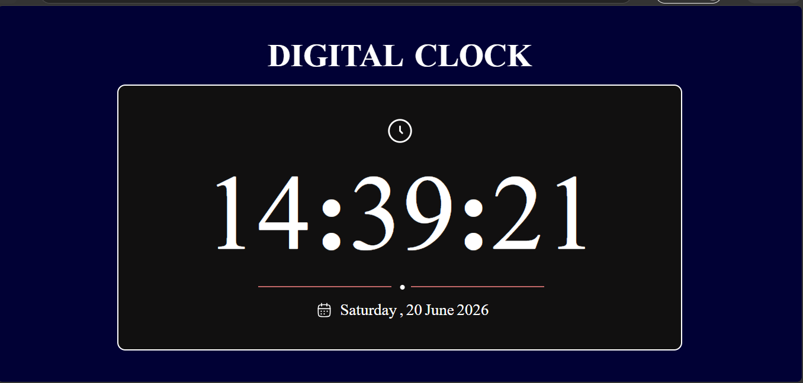

# ⏰ Digital Clock

A responsive Digital Clock built using HTML, CSS, and JavaScript. It displays the current time, day, and date in real time using the JavaScript `Date` object and `setInterval()`.

## 🚀 Features
- Live time updates every second
- Displays current day and date
- Responsive design
- Clean dark-themed UI

## 🛠️ Tech Stack
- HTML
- CSS
- JavaScript

## 📸 Screenshot

